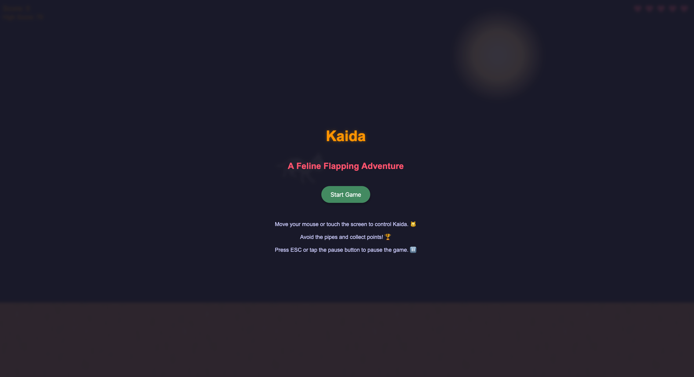
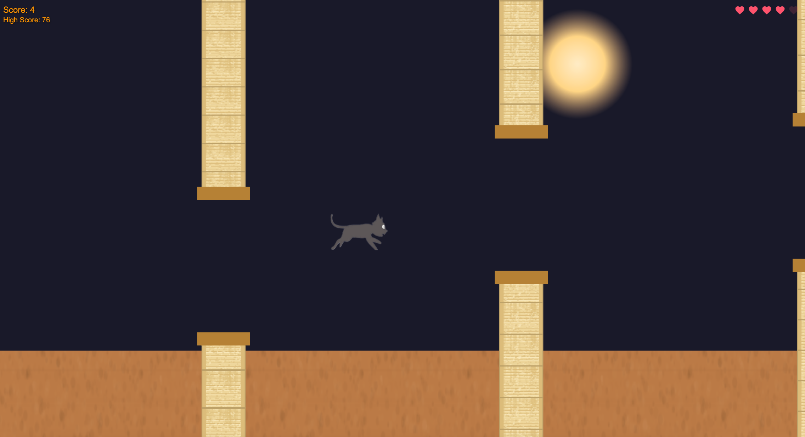

# 🐱 Kaida - The Flappy Cat Adventure

A fun and addictive 2D game inspired by Flappy Bird, featuring Kaida the cat as the main character. Navigate through obstacles, collect points, and try to achieve the highest score!

## 🔗 Links

- **Live Game**: [kaida.danials.space](https://kaida.danials.space/)
- **Source Code**: [github.com/danial2026/kaida](https://github.com/danial2026/kaida)
- **Developer**: [danials.space](https://danials.space)

## ✨ Features

- **Responsive Design**: Play on both desktop and mobile devices
- **Touch Controls**: Intuitive touch controls for mobile gameplay
- **Smooth Animations**: Fluid cat animations with sprite-based rendering
- **Progressive Difficulty**: Game becomes more challenging as you score higher
- **Lives System**: Multiple hearts give you chances to recover from mistakes
- **High Score Tracking**: Your best performance is saved locally
- **Mobile-Friendly UI**: Optimized interface for various screen sizes
- **Engaging Sound Effects**: Audio feedback enhances the gaming experience

## 🎮 How to Play

- **Desktop**: Move your mouse to control Kaida's position
- **Mobile**: Touch and drag to guide Kaida through the course
- Avoid hitting the obstacles (cat scratchers)
- Each obstacle passed earns you points
- You have 5 hearts - each collision costs one heart
- The game ends when you lose all hearts
- Try to beat your high score!

## 🛠️ Technologies Used

- **Three.js**: For rendering the game in WebGL
- **ES6 JavaScript**: Modern JavaScript for game logic
- **CSS3**: For responsive UI styling
- **Vite**: For fast development and optimized builds
- **HTML5**: For structure and canvas support

## 📋 Installation

1. Clone the repository:
   ```bash
   git clone https://github.com/danial2026/kaida.git
   cd kaida-game
   ```

2. Install dependencies:
   ```bash
   npm install
   ```

3. Start the development server:
   ```bash
   npm run dev
   ```

4. Open your browser and navigate to the URL shown in the terminal (usually http://localhost:5173)

## 📱 Mobile Setup

For optimal mobile testing during development:

1. Find your local IP address
2. Run the dev server with host flag:
   ```bash
   npm run dev
   ```
3. Connect to the provided IP address from your mobile device

## 🎯 Game Controls

### Desktop
- **Mouse Movement**: Control Kaida's position
- **ESC**: Pause/Resume game

### Mobile
- **Touch & Drag**: Control Kaida's position
- **Tap Buttons**: For game actions (start, pause, resume, retry)

## 📚 Project Structure

```
kaida-game/
├── assets/            # Game assets (images, sounds, data)
│   ├── images/        # Sprite sheets and images
│   └── sounds/        # Game sound effects
├── js/                # Game logic modules
│   ├── cat.js         # Kaida character logic
│   ├── game.js        # Core game mechanics
│   ├── obstacles.js   # Obstacle generation and collision
│   ├── sound.js       # Audio management
│   ├── textures.js    # Texture creation
│   └── ui.js          # User interface handling
└── index.html         # Main game page
```

## 🙏 Credits

- **Art & Animation**: Custom Kaida cat spritesheet
- **Sound Effects**: Modified from free sound libraries
- **Programming**: Created with ❤️ for Kaida
- **Game Design**: Inspired by classic side-scrolling games

## Game Play Screenshots


 
 
## 📄 License

This project is licensed under the [MIT](LICENSE) License - see the LICENSE file for details.

---

Enjoy playing with Kaida! 🐱✨ 